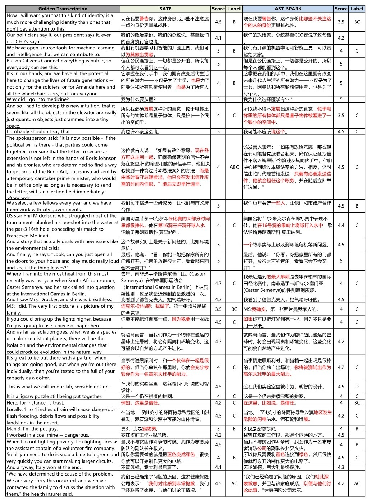

# Adversarial Speech-Text Pre-training for Speech Translation

## Introduction
This repository contains the manual scoring rubrics and partial scoring results used in _Adversarial Speech-Text Pre-training for Speech Translation_ submitted to ICASSP 2025.

## Human Evaluation Guidelines

This study employs a set of human evaluation criteria to assess the quality of machine translations. The evaluation is based on a 6-point scale ranging from 0 to 5, with each score representing a specific level of quality and accuracy of the translation compared to the original text. Below are the detailed scoring criteria:

### Scoring Criteria

| Score | Description |
|-------|-------------|
| 0     | The translation is entirely absent. |
| 1     | The translation is largely incomprehensible or entirely incorrect. Only a small portion of words is translated correctly. |
| 2     | The translation partially conveys some of the original text's meaning; or the whole sentence is incorrect but key words are translated in isolation, providing some utility for human editing. |
| 3     | The translation conveys the general meaning of the original text, with only partial discrepancies. Typically, one would need to refer to the original text to correct the errors in the translation. Occasionally, the meaning can be guessed without referencing the original text, but the inaccuracies are clearly due to shortcomings in the translation program. |
| 4     | The translation conveys the original text's message clearly even without referring to the original text, however, it may have issues with word forms, word order, polysemy, appropriateness, etc. These problems require corrections, but such corrections can be confidently done without the original text and are relatively straightforward. |
| 5     | The translation accurately and fluently conveys the original text's message with correct grammatical structure. Apart from minor issues such as typos, small words, singular/plural forms, or slight unnaturalness, there are no significant problems. These minor issues require only minimal corrections, or the translation is entirely correct and needs no modification. |

### Description of Scoring Application

In this research, the human evaluation guidelines are applied to systematically measure the performance of machine translation systems. Evaluators use the above criteria to assign a score to each translated segment, allowing for a detailed analysis of the machine translation's strengths and weaknesses. The scoring process is designed to identify specific areas where translations fall short and where they excel, providing constructive feedback for improving translation algorithms.

Note that to ensure a fair comparison, when evaluating multiple systems, we randomly shuffle the ordering of outputs from different systems for each semantic fragment. This prevents the human evaluators from being able to identify any specific system, thus eliminating potential bias in their evaluations.

This rigorous evaluation framework allows us to accurately assess the performance of our translation system in comparison to the competing systems, providing insights into areas of strength and opportunities for further improvement.

## Examples of Detailed Evaluation Results
We provide a detailed human evaluation result for our Machine Translation system in follow tables, where we present the golden source transcription, the output of AST, and translations of AST+Our MT, SATE, and AST-SPARK systems. To ensure a representative assessment, we randomly select some of the test samples from our MuST-C tst-COMMON dataset for inclusion.

### Machine Translation Evaluation Cases

Since the English audio in the English-Chinese, English-German, and English-Japanese test sets of MuST-C is the same batch, we take English-Chinese as an example here and provide an English-Chinese analysis example.

<table>
  <tr>
    <th colspan="2" style="text-align:center">Case 1: More coherent, more concise, more localized translation</th>
  </tr>
  <tr>
    <td><strong>Golden Transcription</strong></td>
    <td>I mean, when I'm in an elevator all alone, I do all sorts of weird things, but then other people get onboard and I stop doing those things because I don't want to bother them, or, frankly, scare them.</td>
  </tr>
  <tr>
    <td><strong>AST</strong></td>
    <td>I mean, when I'm in an elevator all alone, I do all sorts of weird things, but then other people get onboard and I stop doing those things because I don't want to bother them, or, frankly, scare them.</td>
  </tr>
  <tr>
    <td><strong>SATE</strong></td>
    <td>我的意思是，当我一个人在电梯里的时候，我会做各种奇怪的事情，但是当其他人上来的时候，我就不再做那些事情了，因为我不想打扰他们，或者，坦白地说，吓唬他们。</td>
  </tr>
  <tr>
    <td><strong>AST-SPARK</strong></td>
    <td>我的意思是，当我独自在电梯里时，我会做各种奇怪的事情，但当其他人进来时，我就会停止做这些事情，因为我不想打扰他们，<u>或者坦白说，不想吓到他们</u>。</td>
  </tr>
  <tr>
    <td><strong>Explanation</strong></td>
    <td>Both SATE and AST-SPARK manage to retain the general meaning and informal tone of the original sentence. However, AST-SPARK provides a more natural and fluid translation, using "或者坦白说"  vs. "或者，坦白地说，" and "不想吓到他们"  vs. "吓唬他们" , which aligns closer with how native speakers would express themselves. This helps maintain the informal but clear manner of the spoken text.</td>
  </tr>
</table>

<table>
  <tr>
    <th colspan="2" style="text-align:center">Case 2: Informal, disfluent speech translation</th>
  </tr>
  <tr>
    <td><strong>Golden Transcription</strong></td>
    <td>And I came out of medical school with the impression that if I memorized everything and knew everything, or as much as possible, as close to everything as possible, that it would immunize me against making mistakes.</td>
  </tr>
  <tr>
    <td><strong>AST</strong></td>
    <td>And I came out of medical school with the impression that if I memorized everything and knew everything, or as much as possible, as close to everything as possible, that it would immunize me against making mistakes.</td>
  </tr>
  <tr>
    <td><strong>SATE</strong></td>
    <td>当我从医学院毕业时，我有这样的印象，如果我记住了所有的东西，知道了所有的东西，或者尽可能的多，尽可能的接近所有的东西，这将会使我免于犯错。</td>
  </tr>
  <tr>
    <td><strong>AST-SPARK</strong></td>
    <td>我从医学院毕业时的印象是，如果我把所有东西都记住，了解一切，或者尽量了解尽可能多的东西，这将让我免于犯错误。</td>
  </tr>
  <tr>
    <td><strong>Explanation</strong></td>
    <td>The complexity of this sentence lies in its length and nested clauses. SATE's translation captures the general meaning but is somewhat repetitive and less fluent ("尽可能的多，尽可能的接近所有的东西"). In contrast, AST-SPARK delivers a more fluent and coherent translation: "尽量了解尽可能多的东西" provides a clearer and more natural reading experience. Additionally, SATE's use of "这将会使我免于犯错" is less common in natural discourse compared to AST-SPARK's "这将让我免于犯错误", which sounds more native-like.</td>
  </tr>
</table>

<table>
  <tr>
    <th colspan="2" style="text-align:center">Case 3: Named-entity recognition and speech translation</th>
  </tr>
  <tr>
    <td><strong>Golden Transcription</strong></td>
    <td>Vaclav Havel, the great Czech leader, talked about this.</td>
  </tr>
  <tr>
    <td><strong>AST</strong></td>
    <td>Vacant hovel，the great Czech leader, talked about this.</td>
  </tr>
  <tr>
    <td><strong>SATE</strong></td>
    <td>伟大的捷克领导人空荡荡的小屋谈到了这一点。</td>
  </tr>
  <tr>
    <td><strong>AST-SPARK</strong></td>
    <td>捷克伟大的领导人瓦茨拉夫·哈维尔谈到过这一点。</td>
  </tr>
  <tr>
    <td><strong>Explanation</strong></td>
    <td>This example highlights the difficulty of correctly recognizing and translating proper nouns. The AST system mistakes "Vaclav Havel" for "Vacant hovel," leading to a nonsensical translation in SATE, which translates to "空荡荡的小屋" (vacant hovel). In contrast, AST-SPARK accurately identifies and translates "Vaclav Havel" as "瓦茨拉夫·哈维尔," preserving the proper noun and providing a clear and correct translation. This underscores the importance of accurate name recognition in maintaining the fidelity of the translation.</td>
  </tr>
</table>

<table>
  <tr>
    <th colspan="2" style="text-align:center">Case 4:Contextual semantic translation</th>
  </tr>
  <tr>
    <td><strong>Golden Transcription</strong></td>
    <td>Ladies and gentlemen, meet your cousins.</td>
  </tr>
  <tr>
    <td><strong>AST</strong></td>
    <td>Ladies and gentlemen, meet your cousins.</td>
  </tr>
  <tr>
    <td><strong>SATE</strong></td>
    <td>女士们先生们，来见见你们的表亲。</td>
  </tr>
  <tr>
    <td><strong>AST-SPARK</strong></td>
    <td>各位女士们、先生们，大家好，见到你们感到很亲切。</td>
  </tr>
  <tr>
    <td><strong>Explanation</strong></td>
    <td>Here we see a challenge in translating idiomatic or culturally specific expressions. The SATE translation "见见你们的表亲" is more literal, directly translating "meet your cousins." However, this may not convey the intended warm or informal greeting context in Chinese. AST-SPARK's translation "见到你们感到很亲切" rephrases the sentence for a more culturally appropriate expression, which while not literal, captures the intended friendly and welcoming tone better. This demonstrates an advantage in producing translations that better resonate within the target cultural context.</td>
  </tr>
</table>

Here, we provide a partial screenshot of the specific scoring results, which includes the translation evaluation scores of the SATE and AST-SPARK systems. In this screenshot, the "Label" column indicates the category of evident errors for each data entry. If a clear error type can be identified, we assign one or more labels for subsequent analysis. Specifically, 'A' stands for over-translation or under-translation, 'B' denotes mistranslation, 'C' indicates literal translation, and so on.

